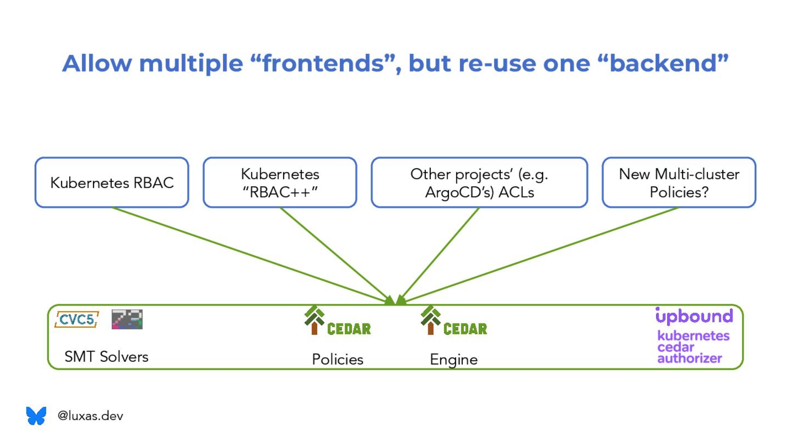
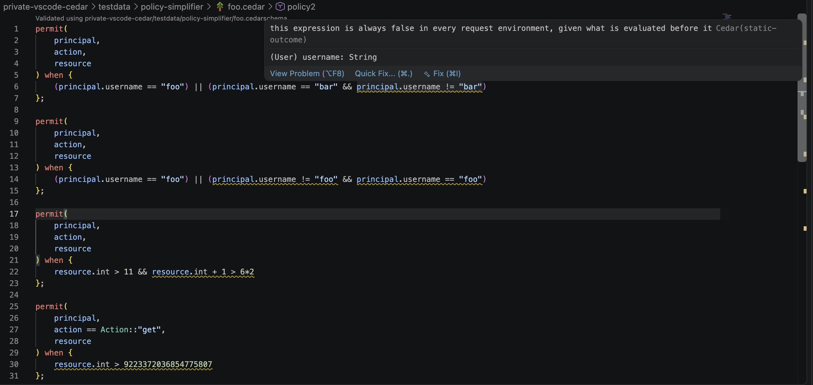
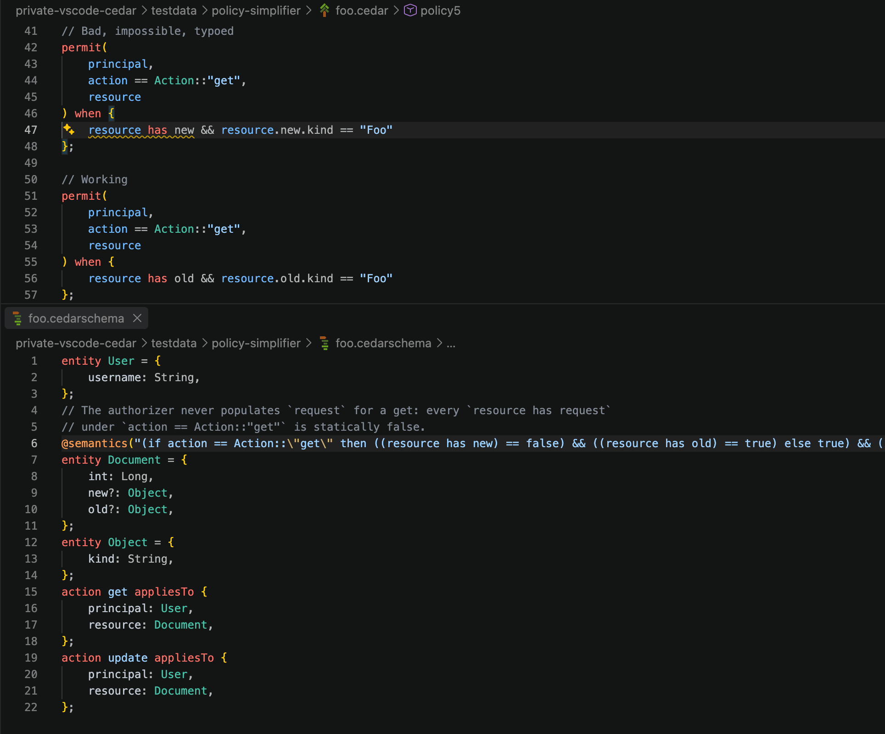

# `cedar-woodpecker` on top of [`cedar`](https://github.com/cedar-policy/cedar)

**Summary:** This repository contains four new feature ideas (accompanied by for-now LLM-generated proofs of concept), on top of the baseline `cedar` respository. It is worth pointing out that the author of the ideas is Lucas Käldström (@luxas), the ideas are **NOT** LLM-generated, LLMs have just been used as a tool to show something concrete (during the so far short time between Aug 25 - Sept 12 I've had developing these ideas). It should also be mentioned that this `README.md` document is completely written by me, and I consider this document to be the primary contribution in this repo. Eventually, I intend to improve (most likely by starting more or less from scratch with regards to every feature PR) the code, docs, tests and proofs, if the ideas make sense to the Cedar community. I'm happy to upstream the features to Cedar as well, into core or some extension, as wanted/needed. My main goal at this moment is to:

1. validate the ideas by discussing with others (I'm not 100% certain of whether all parts of the ideas make sense)
1. ask for feedback on the direction by the community (feel free to email me about this, or send a DM on the CNCF Slack or LinkedIn!)
1. showcase in hopefully a little bit more detail what it means for Cedar to be "analyzable" and/or have a "decidable encoding into mathematical logic", and what the benefits and opportunities are

> **WARNING:** The commits in this repo on top of mainline `cedar` **MUST NOT be used in production**; they serve only as a concretization of the ideas presented, to evaluate what direction to evolve the ideas towards, and to give something that can be experimentally tested and iterated on, in search of the final form of the features.

The original `README.md` for mainline Cedar can be found in [`README-old.md`](README-old.md).
In the rest of this text, I'll summarize the ideas in a blog post-style way initially, then go more technical.
For now, I've only had time to go one pass over this text, I'll try to make it more understandable over time, if needed.
I intend to turn this text into a series of "real" blog posts later, most likely going into more depth on each topic there.

**Show me the source, Luke:** Basically, my writing here is a summary of my scratch notes in my valued notebooks (see picture below), on top of which this proof of concept is based.


## Preamble: Methodology

I went back and forth for a while whether I should make a completely separate repository with this writeup and PoC code or "rebase" all docs and code on top
of the mainline Cedar repository (where it might be confusing to tell the difference between what is normal Cedar and this contribution).
However, I ended up opting for the latter, for two reasons:

1. I wanted to minimize the diff to what would sensibly possible be done if the Cedar community chose to accept some of it (e.g. [`possible_bool_outcomes`](https://github.com/cedar-policy/cedar/issues/2122) -- this code I wrote myself for the most part)
1. I wanted to increase my certainty in whether the features / rewrites I did were correct, and force Claude, which I used for generation, to have to logically reason about why a rewrite / feature was correct by writing a corresponding Lean proof in `cedar-spec`.
1. The PRs against this repo contain some proofs, and indeed the LLM-generated code was incorrect a dozen of times from the initial generation, until the feedback loop of the proof + differential random testing caught it and Claude fixed the implementation bug.
1. However, I have not had time yet to actually check whether the statement of the Lean proofs are correct; so until then, the `cedar-spec` are **extremely provisional** until me (and potentially others) review them. They are just there for now as a forcing function for an honest LLM to think about the implementation correctness before declaring victory, but it is possible (indeed, likely) that Claude could have cheated by writing a softer version of the proof that was needed, or even skipping writing a proof altogether.

I iterated on these feature branch implementations a couple of times in a private fork, but ended up squashing most intermediate detours before publishing these results. Even though the stack of PRs against this repo will all be merged (TODO: add a link here once published), the individual stacked PRs should show a somewhat-sensible (hopefully) diff of individual features, which can then potentially be used as a starting point for actual feature implementation in the future, if desired. Note that while I've glanced the implementation code, I have not reviewed yet the way I normally would, but I intend to do so once the shape of this thing settles and I feel more confident in it.

Enough spoken about the methods, let's jump to the most important question: why did I spend the last two weeks tinkering with this?

## Why?

When I introduce Cedar, for example, in this lightning talk at [KCD Suisse Romande at CERN], I mention things like "Cedar can be thought of as an intermediate representation (IR) for access control". The website mentions Cedar is [analyzable][cedar-analysis], but what benefits does that really bring?
The short answer here is that when you have a certain number of access control policies, inertia may have grown to the point of no one really understanding what the policies as a whole are doing anymore.
Especially if you have both allow and deny policies, the amount of cross-terms that need to be taken into account may grow larger than is usually reasonable for the human brain to spend time reasoning about.
Most of that computation is not hard per se, just a lot of repetitive steps.
However, computers are good at doing lots of mundane tasks, so let's build tooling for figuring out what our access control policies are really doing instead.

What a user might e.g. be interested in asking when reasoning about the policies themselves are:

- "What can user `lucas` do in the system (directly)?"
- And also "What can user `lucas` do in the system, through some series of actions that lead to additional implicit privileges?" (spoiler, this is what `cedar-woodpecker` in this repo tries to answer)
- "Who can perform action A on this resource R?"
- "How can we engineer our system so that we spend the minimal amount of resources (e.g. CPU/memory) on bogus requests that never will be authorized?"
- "If I let administrators manage access control policies, how do I prevent them from escalating their own privileges?"
- "Are two sets of policies equivalent; can I safely refactor one (which grew organically) into another that I better structured?" (see example [here][cedar-analysis])
- "If two sets of policies are not equivalent, how do they differ?"
- "Do I have redundant policies, e.g. where an deny policy shadows an allow policy such that the allow never applies in practice?"

In building such a tool, you have face a choice: Do you

1. implement a custom-made search algorithm for the (NP-complete) problem of reasoning about your policies directly in code, or
1. do you reduce your problem into a more generic reasoning form for mathematical logic (called [`SMT-LIB`])?

Cedar chose the latter option with the Cedar Analysis toolkit (called [`cedar-policy-symcc`]); which allows it to focus on _what Cedar policies logically mean_ instead of spending a lot of time making the search algorithm correct. The actual search for proofs (e.g. of two policies being logically equal) is done by the automated theorem prover cvc5.

I think Cedar genuinely shows great potential to serve as a "compilation target", to which you can convert various systems' higher-level policies, visualized in one of my slides (with a Kubernetes audience) as follows:



This is a great north star, but we're definitely not there yet.
But what tools could we make to get closer?

The [`cedar-policy-symcc`] library is great and very powerful, and that, together with [Typed Partial Evaluation] gets you a long way in implementing some of the desired user questions listed above? But can we go further, and can we integrate some of the capabilities of Cedar Analysis into higher-level features that fit better into the day-to-day workflow of users?

That is one of the questions I've been pondering the two recent weeks. I've had three primary use-cases in mind:

- **Eliminating redundancies**: If I write a Cedar policy, how do I know it makes sense and is as simple as possible? Or at least, free of obvious redundancies?
  - The Cedar validator already flags impossible (always-false), but there are many cases which it does not catch right now. What more can we tell our users?
  - For example, when preparing my [KubeCon Atlanta talk] about Cedar and Kubernetes, I had a copy-paste error in one of my policies. The policy naturally didn't work, but it took around 30-60 minutes to debug that the policy was statically `false` and hunt down the error. I would have benefited from something that just told me that directly, and good news -- that should be possible to build! (See the section on the policy simplifier)
- **Reasoning about compound permissions**: Some access control policies are correct and desired in isolation, but incorrect / undesired in combination. As an example, you might have one policy allowing anyone in the `production` group read internal data from production. Separately, someone else might create a support agent that responds to customer tickets. Now the audit team would like to make sure that no internal data can be exfiltrated to public sources. In this case, it is in fact possible -- if the support agent incorrectly were added to the `production` group, it would be able to leak internal production data in response to a maliciously crafted prompt. An example fix here would be to add a blanket `forbid` policy to the support agent, such that one doesn't just rest on default-deny, but make sure it can never get more permissions than a clearly defined boundary.
- **Reasoning about implicit permissions**: Ideally, there would be no implicit permissions or ways of performing privilege escalation. However, such a system would probably be very inconvenient to use. Two example implicit permissions in Kubernetes are:
  - Any user who can `create pods` (or other workloads) in an unconstrained way, together with internet egress or `get pods/{log,exec}` capability, can also `get secrets` inside of the same namespace.
  - Any user who can `patch <resource>` can also `get <resource>`, as they can just send an empty patch and look at the response object.
  - Attackers are well-aware of these attack vectors, but it is hard to defend against any attack path, if/when multiple of these privilege escalation hops are used together in a chain. This especially as the implicit permissions do not show up in a normal audit, even in a system with "who can perform action A on resource R?" or "what can principal P do in the system?", which is a fairly rare / advanced capability to begin with.

[KCD Suisse Romande at CERN]: https://speakerdeck.com/luxas/cedar-a-rock-solid-access-control-building-block-for-the-cloud-native-ecosystem
[cedar-analysis]: https://cedarpolicy.com/blog/introducing-cedar-analysis
[`SMT-LIB`]: https://smt-lib.org/
[`cedar-policy-symcc`]: https://docs.rs/cedar-policy-symcc/latest/cedar_policy_symcc/
[Typed Partial Evaluation]: https://cedarpolicy.com/blog/tpe
[KubeCon Atlanta talk]: https://speakerdeck.com/luxas/tools-and-strategies-for-making-the-most-of-kubernetes-access-control

With all of this context, let's look into the four ideas I've explored, both in my notebook and through these proofs of concept:

## Removing redundancies in your policies using the Policy Simplifier

One of the reasons to write policies in a higher-level language or format than Cedar, would be to provide a more limited set of capabilities to the user, and make the user "fall into the pit of success" for that specific context.
The more general-purpose and expressive the language becomes, the harder it is to say anything about it.

Cedar already is expressive enough to do silly things. For example, consider the policies in the following screenshot:



Consider the first policy. If `principal.username == "foo"`, the policy will be true, and the principal will get access.
However, if that is not the case, evaluation proceeds to the content within the parenthesis.
The and expression within the parenthesis is unsatisfiable though, there is no way `principal.username` can both equal `bar` and not equal `bar`.
Thus, could everything within the parenthesis be deleted, and policy would be equal, but simpler.
Or if this was an error does the author a heads up to fix the inconsistency.

The second policy showcases a similar impossibility in the last `principal.username == "foo"` term, but why does the linter warn about `principal.username != "foo"` too?
The reason is that Cedar's `&&` (and) and `||` (or) operators are _not_ commutative. In other words, `A && B` is _not_ the same thing as `B && A`.
This mirrors many programming languages, if `A` is `false`, the program short-circuits and doesn't bother checking `B` as the AND of them will anyways be `false`.
In this specific case, we thus know that if we proceed to the parenthesis branch of the second policy, it must be the case that the first term `principal.username == "foo"` was `false` (otherwise the `||` operator would have short-circuited). This means that `principal.username != "foo"` is thus `true`, and could be omitted.

The third policy showcases that this logic also generalizes to reasoning about integers (`resource.int + 1 > 6*2` is either true or overflows), and even understands that no 64-bit integer `resource.int` can be larger than the maximum 64-bit integer value `9223372036854775807`. Static integer overflows like `9223372036854775806 + 2` also are reported by the linter as always erroring.

This is prototyped in the experimental `cedar lint` command, which builds on top of Cedar Analysis, and in particular the topic of the next section, the Symbolic Cedar Evaluator. The VS Code extension in turn surfaces the lint errors from `cedar lint` right in your IDE.

A request environment in Cedar is a tuple of `(principal type, action type, resource type)`. The linter produces findings of form:

- Expr "xxx" resolved to "yyy" in _all request environments_.
- Expr "xxx" resolved to "yyy" in request environments [a, b] and "zzz" in request environments [c, d, e].
- Expr "xxx" is always [True, Error] / [False, Error] in _all request environments_ / in request environments [a, b] and "zzz" in request environments [c, d, e].
- Expr "xxx" always errors in _all request environments_ / in request environments [a, b] and "zzz" in request environments [c, d, e].

### Semantic linting

Finally, it is even possible to give Cedar some hints about how the authorizer of a given Cedarschema works in practice, and use that authorizer invariant information to decide whether certain policies must be true or false.

In the [KubeCon Atlanta talk] story I mentioned, I did something similar to what's shown below:



The authorizer worked in the way that for a `get` request, only `resource.old` was set, never `resource.new`, as naturally for a HTTP GET request you don't have a request body. For an `update`, however, both are available, and for a `create`, only `resource.new` is.

Thus, under the assumption that the request actually is a `get`, `resource has new` is always `false` in this context.
Cedar cannot know how a specific authorizer and schema works in general, but if you tell it, in this repo implemented as a `@semantics` annotation in the Cedar schema, the linter will correctly warn that the first policy is impossible, but the latter one is completely valid (can become either true or false, depending on the context).

## A third Cedar evaluator: The Symbolic Evaluator

Cedar already comes with two evaluators: the default _concrete_ evaluator and the (experimental) _typed partial
evaluator_ (TPE). (The concrete evaluator also contains an untyped partial evaluator that is
planned to be removed.)

The concrete evaluator throws an error if an entity or attribute that a policy dereferences is not provided. The partial evaluator tolerates missing entities and attributes, but if set, requires entities and attributes be set to a specific value (like the concrete evaluator). The symbolic evaluator generalizes both by allowing both missing data and multiple possible assignments to each considered simultaneously.

Consider the following example schema, policy and entities:

```cedarschema
entity User = {
  username: String,
};
entity Document = {
  protected: Bool,
};
action view appliesTo {
  principal: User,
  resource: Document,
};
```

```cedar
permit(principal == User::"lucas", action, resource) when { !resource.protected }
```

Entities:

- `User::"lucas".attrs = {username: "luxas"}`
- `Document::"foo".attrs = {protected: false}`

However, logically, the given `principal` and `resource` instantiation and entity attribute assignments can be encoded as a logical formula (in pseudo-logic):

```
principal == User::"lucas" && action == Action::"view" && resource == Document:"foo" && User::"lucas".attrs.username == "luxas" && Document::"foo".attrs.protected == false
```

Now, a pseudo-logic form of the above Cedar policy would simply be:

```
principal == User::"lucas" && !resource.attrs.protected
```

Considering two-value logic at first (only `true`/`false`, no errors), what the evaluator does when considering the left-hand side (LHS) `principal == User::"lucas"` of the above policy is consider
"do the current assignments imply that the current expression has to be true or false?". In other words, if:

```
(principal == User::"lucas" && action == Action::"view" && resource == Document:"foo" && User::"lucas".attrs.username == "luxas" && Document::"foo".attrs.protected == false) => ((principal == User::"lucas") == true)
```

is `true` under these assumptions it is perfectly fine to replace `principal == User::"lucas"` with `true`.
Vice versa for checking whether `((principal == User::"lucas") == false)` is implied.

In order to in practice solve for validity, which requires the expression to be true for _every possible assignment to the variables_ (which could be infinite, e.g. if there is an arbitrary string, then it could take an infinite amount of values),
one asks the for the negation "does there exist some counterexample when the negation of the expression would be true?". In other words, the following (simplified) is sent to an SMT solver:

```
principal == User::"lucas" && action == Action::"view" && resource == Document:"foo" && User::"lucas".attrs.username == "luxas" && Document::"foo".attrs.protected == false && !(principal == User::"lucas")
```

Now, one can observe that this is unsatisfiable, there doesn't exist any assignment such that both `principal == User::"lucas"` and its negation `!(principal == User::"lucas")` would be true simultaneously.
Thus is the validity of the expression proven valid, and the evaluator can substitute `principal == User::"lucas"` with `true` and move on.

However, realizing that this is happening offers possibilities for a generalization: what if one did not require only exact assignments of variables to value? What if the assumptions of the evaluator could be an arbitrary boolean expression?
This is what the symbolic cedar evaluator is and offers.

Note that when evaluating with partial information, it might be that neither

```
(assumptions) => (expr == true)
```

nor

```
(assumptions) => (expr == false)
```

are valid statements. In this case, one just keeps the expression unmodified, as it cannot be simplified (just like how the TPE leaves expressions untouched if they relate to partial information).

This means that the symbolic evaluator should evaluate expressions just as the concrete and partial ones, when the entity data known is encoded properly. Differential response tests are set up for this purpose.

### Adding assumptions iteratively

Consider the expression `(a || b) && (c || d)`. Cedar's `And` and `Or` operators always evaluate the left-hand side (LHS) first, and only if that doesn't already give a concrete value (`false && <any> == false` or `true || <any> == true`) continue to the right-hand side (RHS).
Furthermore, if the LHS errors, the error is propagated upwards and the RHS is not considered. This leads to a realization that the only case in which `b` is considered when evaluating the expression `a || b` is if `a` evaluated to `false`!
Similarly for `true` and `And`; `(c || d)` is only considered if `(a || b)` was true.

This means that in order to be able to catch policy inconsistencies in a granular way, a _trail_ of ANDed extra assumptions resulting from how previously-visited policy expression nodes must have evaluated can be added.
Using this, one can catch things like `(a && b) || (a && !a)` and warn the user about it. This is an example of where `verify_never_matches` is not enough, the policy indeed sometime matches (when `a && b` is true), but the latter branch `a && !a` is dead.
This method is what powers the policy simplifier described above.

Finally, note that the symbolic evaluator does not need to descend down below boolean atoms of the expression, but can encode those directly in SMT and solve towards `true` or `false`. In other words, while the concrete evaluator goes in and assigns a `Value`,
e.g. to String, Entity, Record AST nodes, SymCC does not know that, but doesn't need to either, as the eventual goal is to assign a boolean value to the top-level expression.

### Three-value logic

So far we've mostly discussed two-value logic, where a boolean expression is always `true` or `false`. However, Cedar in fact uses three-value logic, which means that a boolean expression can be `true`, `false` or `error`.
This is represented as a `Option<bool>` in Lean and SMT, which means that to make the above example more correct, the implication wouldn't use `((principal == User::"lucas") == true)` but `((principal == User::"lucas") == .some true)`

This has some interesting consequences, such as that while `false && <any>` evaluates to `false`, `<any> && false` does not necessarily evaluate to `false`, if `<any>` could evaluate to an error.

However, in practice, a user is interested in whether a full request is allowed or denied, and from this perspective the user might not care about whether the evaluation outcome was `false` or `error`, just whether the policy evaluated to `true` or not.
This is where the concept of `possible_bool_outcomes` comes in. It is represented as a non-empty set of a `True`, `False` and `Error` enum, which means the set has 7 possible assignments:

- `{True}`
- `{False}`
- `{Error}`
- `{False, Error}`
- `{True, False}`
- `{True, Error}`
- `{True, False, Error}`

The single-valued possible outcomes clearly corresponds to that exact value. `<any> && false` falls into the `{False, Error}` category, and `<any> || true` into the `{True, Error}`.
If an expression is provably error-free, it falls into `{True, False}`, and otherwise `{True, False, Error}` which provides the least amount of information.

How do we then calculate the possible boolean outcomes of an expression like `<lhs> && <rhs>`? For each possible outcome of the LHS, let's consider what possible outcomes there would be under that assumption, and union all results.
If LHS was `false`, the return value would be `false`. If LHS errored, the return value would be an error. If LHS was `true`, the possible outcomes are completely determined by the possible outcomes of the RHS. On the contrary, just because the LHS would
evaluate to true it does _not_ mean the whole `And` expression would. This gives a handy and straightforward algorithm that also transfers to the other boolean-valued expression nodes `Or`, `If` and `Not`.

This means that for each boolean atom in the expression, the symbolic evaluator asks the solver three
satisfiability questions under the current assumptions: can the atom be `true`, can it be `false`, can it
error (`.some true`, `.some false` and `.none` in the SMT encoding). The three cases are mutually exclusive
and exhaustive, so the answers are the set of possible outcomes.

One gotcha that needs to be taken into account in practice; the SMT encoding assumes the entity store contains all entity references from the policies and other entities. During concrete evaluation, this might not be the case, and thus must the symbolic evaluator be careful not to decide a given expression to `true` when it in fact could error on a missing entity.

## Enumerating all the possible ways of becoming authorized

A Cedar policy can contain multiple ORed branches of distinct ways of becoming authorized from the same single `permit` policy. However, conditionals could be nested in arbitrarily complicated ways, even within boolean atoms of the expression.

Consider for example the following policy:

```cedar
permit(principal, action, resource) when {
  principal.foo && (resource.foo || resource.bar == (if principal.baz == "baz" then principal.record1 else {attr: "static"}).attr)
};
```

To know under what exact cases a principal can be authorized, we can turn the policy into [disjunctive normal form] (DNF), the "ORs of ANDs" form, into the following:

```cedar
permit(principal, action, resource) when {
  principal.foo && resource.foo
};

permit(principal, action, resource) when {
  principal.foo && principal.baz == "baz" && resource.bar == principal.record1.attr
};

permit(principal, action, resource) when {
  principal.foo && !(principal.baz == "baz") && resource.bar == "static"
};
```

Depending on the context, this might be easier or harder to understand. At the very worst, this transformation might make the expression size grow exponentially. However, the symbolic evaluator is useful here to prune the policies that anyways won't ever contribute to a decision by evaluating to `true`.

On a high level, here are a couple of rewrite rules for the DNF transformation for boolean atoms:

- `a && (b || c)` <=> `(a && b) || (a && c)`
- `(a || b) && c` <=> `(a && c) || (!a && b && c)`
- `if a then b else c` <=> `(a && b) || (!a && c)`
- etc.

In addition, there might be ORs within a boolean atom, as could be seen in the previous policy example with the `if principal.baz == "baz" then ...` case extracted into two policies with the test expression in both positive and negative form. Other funny examples that might need splitting is `[a && b].contains(c)`, `{f: a || b}.f`. An expression that consists only of AND nodes `a && ... && z` is called a DNF cube.

Finally, after one has obtained the DNF cube, one might still do a couple of simplifications that are now possible. For example, one can simplify `{a: <expr1>, b: <expr2>}.a` into `<expr1>` if `<expr2>` cannot error. If `<expr2>` could error, one needs to add a "dummy guard" `<expr2> == <expr2>` (which is `true` or errors) to make sure the same error is returned as before, as when evaluating the record (or set) expression, that node errors if any of the child expressions do. With`<expr2>` possibly erroring, one can simplify `{a: <expr1>, b: <expr2>}.a` into `<expr2> == <expr2> && <expr1>`.

The similar transformation can be done for literal sets, but in this case new disjunct policies are created, e.g. `<expr1> && [<expr2>, <expr3>].contains(<expr4>)` becomes:

```
<expr1> && <expr3> == <expr3> && <expr2> == <expr4>
```

or

```
<expr1> && <expr2> == <expr2> && <expr3> == <expr4>
```

[disjunctive normal form]: https://en.wikipedia.org/wiki/Disjunctive_normal_form

### Combining allow and deny policies

Sometimes I've wondered how it can be the case that authorization feels so simple and so complicated simultaneously. One case of the semantical rules being simple, yet understanding the system as a whole being complex, is how allow and deny policies interact.

After transforming a set of policies into DNF form, let the `PolicySet` have `n` allow policies, `m` deny policies, all policies consisting only of up to `k` ANDed terms of form:

```
(
  eval "a_11 && ... && a_1k" = .some true OR 
  ... OR 
  eval "a_n1 && ... && a_nk" = .some true
) AND 
NOT (
  eval "d_11 && ... && d_1k" = .some true OR 
  ... OR 
  eval "d_m1 && ... && d_mk" = .some true
)
```

which is equal to the following, when the `NOT` is moved into the last parenthesis:

```
(
  eval "a_11 && ... && a_1k" = .some true OR 
  ... OR 
  eval "a_n1 && ... && a_nk" = .some true
) AND 
eval "d_11 && ... && d_1k" != .some true AND 
... AND 
eval "d_m1 && ... && d_mk" != .some true
```

which when turned into DNF form becomes:

```
(
  eval "a_11 && ... && a_1k" = .some true AND
  eval "d_11 && ... && d_1k" != .some true AND
  ... AND 
  eval "d_m1 && ... && d_mk" != .some true
) OR 
... OR 
(
  eval "a_n1 && ... && a_nk" = .some true AND
  eval "d_11 && ... && d_1k" != .some true AND
  ... AND
  eval "d_m1 && ... && d_mk" != .some true
)
```

What are the possible modes for `eval "d_j1 && ... && d_jk" != .some true` for deny policy `j` to be satisfied?
If the deny policy indeed returned false or error, it means that some sub-term caused that error, even after the assumption of the previous term being true.
In other words, it turns into:

```
if eval "d_j1" != .some true then true else
  if eval "d_j2" != .some true then true else
    ...
      if eval "d_jk" != .some true then true else false
```

Which is effectively a nested OR.
If Cedar would add an `iferror` operator (or similar) to catch the error, one could turn the logic into something compatible with `eval "..." = .some true` which is needed to merge with the allow policies:

```
if eval "!iferror(d_j1, false)" == .some true then true else
  if eval "!iferror(d_j2, false)" == .some true then true else
    ...
      if eval "!iferror(d_jk, false)" == .some true true else false
```

This can now be simplified into a simple OR structure:

```
eval "!iferror(d_j1, false)" == .some true OR
eval "d_j1 && !iferror(d_j2, false)" == .some true OR
eval "d_j1 && ... && d_j{k-1} && !iferror(d_jk, false)" == .some true
```

The preceding trail of `d_j1 && ... && d_j{k-1}` terms are added to keep the semantics intact (e.g. for `principal has foo && principal.foo`), and to potentially help the symbolic evaluator reduce some implied terms later.

To shorten notation, assign `eval_d_jl := eval "d_j1 && ... && d_j{l-1} && !iferror(d_jl, false)" == .some true`.

Now, however, one can see that for one allow policy, there is worst-case unfortunately a lot of combinations:

```
eval "a_11 && ... && a_1k" = .some true AND
eval "d_11 && ... && d_1k" != .some true AND
... AND
eval "d_m1 && ... && d_mk" != .some true
```

which can be simplified to:

```
eval "a_11 && ... && a_1k" = .some true AND
(eval_d_11 OR ... OR eval_d_1k) AND
... AND
(eval_d_m1 OR ... OR eval_d_mk)
```

which using the rule `(a OR b OR c) AND (d OR e OR f)` <=> `(a AND d) OR (a AND e) OR (a AND f) OR (b AND d) OR (b AND e) OR (b AND f) OR (c AND d) OR (c AND e) OR (c AND f)` (from which the `3^2` or in general `k^m` exponential blowup can be seen) becomes:

```
eval "a_11 && ... && a_1k" = .some true AND
(
  (eval_d_11 AND ... AND eval_d_m1) OR 
  ... OR 
  (eval_d_1k AND ... AND eval_d_mk)
)
```

which then when simplified becomes:

```
(eval "a_11 && ... && a_1k" = .some true AND eval_d_11 AND ... AND eval_d_m1) OR
...
(eval "a_11 && ... && a_1k" = .some true AND eval_d_1k AND ... AND eval_d_mk)
```

Turning the deny policies' expressions into DNF form incurs an exponential blowup to `O(k^m)` DNF terms, for a total worst-case of `O((k^m)*n)` amount of policies.

The rationale is that in order for someone to be allowed from a given allow policy, the request must be such that _at least one term_ within _every_ deny policy is negated.

This combinatorial explosion explains why humans have a hard time comprehending these policy crossterms in the first place.
Luckily, most likely a big chunk of these crossterms are contradictory with each other and simplify to static false by the symbolic evaluator (e.g. `resource is Pod && resource is Secret`).

Lastly, let's look at how we can merge a sample cube (the one in which all deny crossterms end with `1 < l <= k`) into exactly one Cedar policy:

```
eval "a_11 && ... && a_1k" = .some true AND
eval_d_1l AND
... AND
eval_d_ml
```

which becomes the following when the `eval_d_il` definition is plugged in:

```
eval "a_11 && ... && a_1k" = .some true AND 
eval "d_11 && ... && d_1{l-1} && !iferror(d_1l, false)" == .some true AND 
... AND 
eval "d_m1 && ... && d_m{l-1} && !iferror(d_ml, false)" == .some true
```

which becomes the following when merging all `eval` calls, as they all were assumed to evaluate to true anyways:

```
eval "a_11 && ... && a_1k && d_11 && ... && d_1{l-1} && !iferror(d_1l, false) && ... && d_m1 && ... && d_m{l-1} && !iferror(d_ml, false)" = .some true
```

Which means that the inner content of the final `eval` call is the content of a single `permit` policy which is then ORed together with all other DNF cubes.

## Reasoning about privilege escalation risks using `cedar-woodpecker`

Now it is possible to investigate the phenomenon of privilege escalation.
Sometimes, a principal will get more implicit permissions than what is explicitly granted, as illustrated in the why section.

The goal of the `cedar-woodpecker` crate and CLI tool is to _synthesize a new Cedar policy_, which expresses the implicit, transitive permission.
The "rule" for how that implicit permission is granted is specific for each system, but expressed through a transition function.

Levaillant's woodpecker is endemic to the Atlas Mountains of North Africa, where its habitats include Atlas cedar and oak woodland.

The `woodpecker` name comes from that [Levaillant's woodpecker] is native to the Atlas mountains in North Africa, where its habitats include the [Atlas cedar] forests. Furthermore, woodpeckers fittingly exploit the wood that is already rotten.


Image by Francesco Veronesi from Italy - Levaillant's Woodpecker - Oukaimeden Marocco 07_6526, CC BY-SA 2.0, <https://commons.wikimedia.org/w/index.php?curid=39083160>

[Atlas cedar]: https://en.wikipedia.org/wiki/Cedrus_atlantica
[Levaillant's woodpecker]: https://en.wikipedia.org/wiki/Levaillant%27s_woodpecker

The previously mentioned Kubernetes example of "anyone that can create a pod can read a secret within the same namespace". Given the following explicit permission:

```cedar
permit (
  principal,
  action == Action::"create",
  resource is core::pods
) when {
  principal.groups.contains("engineers") &&
  resource.namespace == "foo"
};
```

and the defined transition function that says "anyone who can create pods, can also read secrets in the same namespace", e.g. expressed as

```
action == Action::"create" && resource is core::pods && action' == "get" && resource' == core::secrets && resource'.namespace == resource.namespace
```

Where `action'` and `resource'` denote the new action and resource the principal are able to access.

This leads to the following implicit policy:

```cedar
permit (
  principal,
  action == Action::"get",
  resource is core::secrets
) when {
  principal.groups.contains("engineers") &&
  resource.namespace == "foo"
};
```

The goal of this section is to automatically be able to craft the implicit policy, even in the case multiple source permissions are needed to craft another one.

The way I'm thinking initially about this is to visualize this as a graph, where nodes are DNF cubes.
During a policy's conversion to DNF, multiple cubes might be generated. However, two or more cubes might synthesize the
same implicit, target cube. Transition functions are also restricted to be a DNF cube, but if a logical transition function contains
disjunctions, during DNF conversion, one just gets a couple of independent transition functions.
Each transition function is restricted to apply to exactly one request environment (again, one can generate multiple transition functions if need be),
however, a given transition function might use one or more source request environments (with the requirement that the principal type needs to be equal across all of them).
A single source node can give further possible to zero, one, or more implicit target nodes, through a set of transition functions.

### Combining typechecked and DNF-ified policies with transition functions

The process thus proceeds as follows:

- For each request environment `(pt, at, rt)` in the schema:
  - Partially evaluate the whole `PolicySet` with everything unknown, just in order to perform constant folding.
  - Then convert the `PolicySet` into DNF form, which combines `permit` and `forbid` policies into many `permit`-like policies which just contain a set of conjoined terms. Denote each cube `p_{pid,ci,dj,pt,at,rt}`, where `pid` denotes the permit policy's policy ID, `ci` denotes the cube index of that permit policy, `dj` denotes an composite index of what forbid policies' terms were falsified, and `pt`, `at`, `rt` the request environment.
  - Only those cubes that can become true are added to a list/map of all cubes.
  - To make these operations more efficient, create `TypecheckedPolicy(Set)` types in both `cedar-policy` and `cedar-policy-core` (as is the pattern) that take an underlying `PolicySet` and `Schema`, and then run the validator for every policy in every possible request environment so that we don't need to compute it every time. In addition, there is a constant folding method called `TypecheckedPolicySet::constant_fold(self) -> Self` (which uses TPE to do constant folding) and `TypecheckedPolicySet::symbolic_fold(self, &mut SymEvaluator) -> Self` (which uses the symbolic evaluator to remove redundancies etc.). The type owns `Expr<Option<Type>>` (possibly also `Residual`) of the policies internally, so one could technically evaluate on those directly instead of cloning or re-typechecking every time. In addition, it becomes possible to get the possible boolean outcomes of the policy directly (either stored from the output of the symbolic evaluator or computed from the TPE residual). For functions that take an expression that needs to be type-checked, implement a trait which makes that logic generic, with the default implementation extracted out from what happens today exactly, but where `TypecheckedPolicySet` could return an `Arc<Expr<Option<Type>>` readily without doing new work (given that the schema that the caller wanted to typecheck is the same that was used up-front as well.). As a test, implement this for the symbolic evaluator, but defer rewriting other places in need for this for now (e.g. TPE and SymCC) themselves. In this specific use-case, DNF would be computed first, and then one would use the `TypecheckedPolicySet`'s folding capabilities.
- For each transition function with signature `(pt, [](at_i, rt_i), at', rt', T)`:
  - Copy the normal schema, but add to the context of the action `at'` new context keys of form `context.resource{i}`, `context.action{i}` and `context.context{i}`, where `i` represents the index in the `[](at_i, rt_i)` tuple list. The context fields are required, and have the exact type as defined by `at_i`, `rt_i` and the context type of `at_i`, respectively.
  - If the transition function requires permissions from two request envs, `(pt, at_1, rt_1)` and `(pt, at_2, rt_2)`, which consist of `n` and `m` DNF cubes respectively, there are at most `n*m` possible situations how the principal could use their permissions to get the implicit privilege. This generalizes as well to more than two required permissions, even though the amount of possible combinations grows quickly in this case.
  - The original policies are written against the `principal`, `action` and `resource` variables. However, in order to be able to reason about multiple "intermediate" actions and resources in order to get a "target" action and resource privilege, we need to substitute the variable usage in the original policy when combining them. Thus, replace the `action` variable with the same-typed `context.action{i}` variable of the `at'` context (and similarly for `resource` and `context`), as added to the new schema specific to this transition function. Denote this `rename(<policyexpr>, <var>-><expr>...)` below.
  - The transition function can use the `principal` variable (of type `pt`), `action` (of type `at'`), `resource` (of type `rt'`), `context` (the target request's), as well as all `context.action{i}`, `context.resource{i}` and `context.context{i}` variables (of type `at_i`/`rt_i`/the context type of `at_i`), and is expressed as a conjunction.
  - Thus do we have an expression as follows:

  ```
  (rename(p_{pid_1,c_1,d_1,pt,at_1,rt_1}, action->context.action1, resource->context.resource1) OR ... OR rename(p_{pid_{X_1},c_{Y_1},d_{Z_1},pt,at_1,rt_1}, action->context.action1, resource->context.resource1)) AND
  (rename(p_{pid_1,c_1,d_1,pt,at_2,rt_2}, action->context.action2, resource->context.resource2) OR ... OR rename(p_{pid_{X_2},c_{Y_2},d_{Z_2},pt,at_2,rt_2}, action->context.action2, resource->context.resource2)) AND
  ... (until all input request environments are exhausted)
  AND T
  ```

  From this, turn the above expression as a whole also into DNF form, and verify using SymCC that the expression can become true. If it can, we have a privilege escalation path, which we want to synthesize a new, generalized policy for.

### Soundness and completeness

The goal is that the final, synthesized policy is free of mentions of all intermediate resources. In other words, we want to use a form of _quantifier elimination_. However, as we have uninterpreted functions, we cannot always exactly perform this quantifier elimination. For example, `∃x. f(x) = y` for an uninterpreted `y` doesn't have a quantifier-free equivalent, but can be rewritten as `y ∈ D(f)`, where `D(f)` is the range, the set of possible outcomes of `f`. Thus, sometimes we need to reach for an _over-approximation_. It is important at this point to note that the synthesized policy is **not** meant to be used for actual authorization checks, but only as findings reported to an admin, visualization in an attack path graph, and for answering the question "who can perform action A on resource R?".

In the following notation, fix a request environment `(pt, at, rt', at', rt')` of the transition function, and for simplicity, consider just one source policy `P_old` in DNF form of req env `(pt, at, rt)`. `action` and `action'` are constants (equal to `at` and `at'`, respectively), but the exact assignment to `principal`, `resource` and `resource'` can vary. Now, we need to verify that whatever `P_new` policy we synthesize over the req env `(pt, at', rt')` we synthesize must be an over-approximation:

```
∀ principal ∈ pt, resource' ∈ rt: (∃ resource ∈ rt: P(principal, action, resource) ∧ T(principal, action, resource, action', resource')) ⇒ P_new(principal, action', resource')
```

In other words, whenever it is true that a principal might acquire the target permissions, under those conditions `P_new` must also flag the user as having such permissions.
Checking the validity of the above statement can be done with a SMT solver through the negation, as this is equivalent:

```
¬(∃ principal ∈ pt, resource' ∈ rt: (∃ resource ∈ rt: P_old(principal, action, resource) ∧ T(principal, action, resource, action', resource')) ∧ ¬P_new(principal, action', resource'))
<=> ¬(∃ principal ∈ pt, resource ∈ rt, resource' ∈ rt: P_old(principal, action, resource) ∧ T(principal, action, resource, action', resource') ∧ ¬P_new(principal, action', resource'))
```

In other words, we ask the solver to find a counterexample where the user would be allowed permissions through `P_old` and `T`, but not `P_new`, and if no such counterexample exists, conclude the over-approximation is sound.

However, the simplest over-approximation possible of `P_new` would be `P_new=true`, and that would be sound according to this definition. Such an over-approximation is useless though.
Ideally, we'd like to prove that `(P_old ∧ T) ⇔ P_new`, which could be written as two implications, `((P_old ∧ T) ⇒ P_new) ∧ (P_new ⇒ (P_old ∧ T))`. The first direction was soundness, which we already covered.

Let's write down the other direction in full, and let's try to tweak it into the SMT-solver friendly form like before:

```
∀ principal ∈ pt, resource' ∈ rt: P_new(principal, action', resource') ⇒ (∃ resource ∈ rt: P(principal, action, resource) ∧ T(principal, action, resource, action', resource'))
⇔ ¬(∃ principal ∈ pt, resource' ∈ rt: P_new(principal, action', resource') ∧ ¬(∃ resource ∈ rt: P(principal, action, resource) ∧ T(principal, action, resource, action', resource')))
⇔ ¬(∃ principal ∈ pt, resource' ∈ rt: P_new(principal, action', resource') ∧ (∀ resource ∈ rt: ¬(P(principal, action, resource) ∧ T(principal, action, resource, action', resource'))))
```

This is worse/harder, as now we have a "for all" quantifier within the expression to prove, which means the problem might become undecidable in general.
I'll think whether there is some clever trick one could apply to make this specific case decidable, but this is for now not known.
It is likely that we can prove equivalence (or find counterexamples) in some cases, but not all.

### Policy synthesis procedure

So how do we go about synthesizing `P_new` from just knowing `P_old` and `T`?

First, let's start with a couple of observations:

- First run `P_old ∧ T` through the symbolic evaluator, and verify it has both `False` and `True` as a possible boolean outcome. During this evaluation, the symbolic evaluator folds redundant/implied terms, and `a && true && b` to `a && b` etc., so we have a simpler expression to look at.
  - If the policy is statically `False` (and/or `Error`), it can be ignored as the privilege escalation can never happen.
  - If the policy is statically `True` (and/or `Error`), it means that either something in this privilege escalation process went wrong, or everyone can do anything.
- `P_old` and `T` are already conjunctions, which make it easier to reason about the boolean atoms within.
  - Furthermore, `<boolexpr1> == <boolexpr2>` is rewritten to `(<boolexpr1> ∧ <boolexpr2>) ∨ (¬<boolexpr1> ∧ ¬<boolexpr2>)` during the DNF rewrite, such that all inner structure of AND/OR/NOT is surfaced in the final DNF cube. "Clean" atoms such as `principal.foo == principal.bar` are kept as-is though.
  - The job here is thus to consider each boolean term/atom, and figure out how we can rewrite it in a way that it does not mention the existentially quantified `resource` variable.
- Non-constant data may originate from two places: the entity store and variables.
  - This means that any Cedar `Expr` cannot be statically be constant-folded into a `Value` has _at least one_ reference to an entity ID (e.g. `User::"lucas"`) or variable (that is, `principal`/`resource`/`context`). `action` is a constant within a given request environment like now.
    - TODO: Does Cedar forbid nondeterministic extension functions, or are there in fact three sources of nondeterminism, if a user added their own, custom extension function (e.g. `now()`)?
  - By splitting nested conditionals and records/sets when converting to our strict version of DNF as above, every boolean atom `Expr` with a non-constant LHS or RHS has _exactly one_ such variable or entity UID reference at its root (e.g. `principal.foo.bar` or `User::"lucas" has field1`), _unless_ tags are used, for which one could have e.g. `principal.getTag(resource.name).getTag(context.bar)`.
  - But even in the `hasTag`/`getTag` case, one might be able to repeatedly substitute known facts `<expr> == <const>` or `<expr1> == <expr2>`, such that even a compound expression like `principal.getTag(resource.name).getTag(context.bar)` simplifies into something simple(r).
  - If some expr contains a reference to the quantified and to-be-eliminated `resource` variable, e.g. `resource.foo.bar` or `principal.getTag(resource.name)`, that expression as a whole can take any value in its range; we thus don't know anything about it.
- A conjoined term (of either `P_old` or `T`) which is free of references to the existentially-quantified `resource` variable is left unchanged and written to `P_new`

#### Building equivalence classes

Now, we first start by building equivalence classes, using the following algorithm:

First, find any boolean atom term of form `<expr> == <literal/record>`. Then, everywhere _else_ where `<expr>` is found within the DNF cube, substitute `<expr>` with `<literal>`. Do this iteratively until there is nothing more to do, and prove in Lean that this process terminates in `O(n)` steps, when `n` is the number of terms the whole DNF cube is built up of. Prove in lean that the rewritten expr is equal (potentially up to errors). One interesting case is the not-previously-rewritten `resource.foo == {a: b, ...}` equality, which should be used to substitute the record into all places of `<expr>`; and then `getAttr` simplified such that e.g. `resource.foo == {a: b, ...} ∧ principal.bar == resource.foo.a` into `resource.foo == {a: b, ...} ∧ principal.bar == {a: b, ...}.a`, `resource.foo == {a: b, ...} ∧ principal.bar == b` and finally `principal.bar == b` after `resource` terms are removed.

Because this only needs to be an over-approximation; we can drop symmetric error guards of form `<expr> == <expr>` that were added from the DNF process. It is fine to synthesize an expression that might not error, even though the real/original one would have.

Then, find equalities of form `<leaveexpr> == <removeexpr>`, where `<leaveexpr>` does not contain any reference to the `resource` variable being eliminated, but `<removeexpr>` contains at least one reference. Let the first term of this form define the canonical element of the equivalence class, and thus in all other parts of the expression, substitute `<removeexpr>` with `<leaveexpr>`. Do this iteratively until there's no more work, and prove this rewrite terminates and is equal (up to error kind).

Finally, rewrite `<removeexpr1> == <removeexpr2>` and make `<removeexpr1>` of the first such term the canonical equivalence class element, such that later rewrites (e.g. for sets) "knows" that two different exprs are the same. Do this iteratively until there's no more work, and prove this rewrite terminates and is equal (up to error kind).

#### Quantifier elimination for sets

Next, we can perform quantifier elimination, using the following algorithm:

For strings, there is only `<removeexpr1> like "pat"`, and from the fact that the whole DNF cube was satisfiable, we know there exists at least one assignment (compatible with all other ones) such that that variable is `true`, and thus we over-approximate it to `true`. The logic for `<removeexpr> == <anyexpr>` is similar; we already used that information to propagate as many other constraints as possible, so in the end, these can just be over-approximated to `true`.

For sets, consider a validated Cedar set and the possible Cedar operations that two ANDed set operations can take (`<set>.isEmpty`,`<set> == <set>`,`<set>.contains(<elem>)`,`<set>.containsAll(<set>)`,`<set>.containsAny(<set>)`), together with any negation of either the left or the right term of the AND expression. Make a matrix
of all possible combinations of right op (5 possibilities), right op negative/positive (2 possibilities), left op (5), left op negative/positive (2) and finally, whether it is the LHS or RHS of the left op expression that is being existentially quantified away. One permutation, for instance, is `exists a: a in A AND a in B` <=> `A.containsAny(B) == true`, and another example rewrite is `exists B: C.containsAll(B) AND B.containsAll(A)` <=> `C.containsAll(A)`. The goal is to reduce two ANDed expressions of set operations, with one of three variables being existentially quantified away into one set operation over the remaining
two variables. For each possible permutation (up to symmetry), we either

1. write a Lean proof that a given rewrite is either exact (<=>), or
1. show that there does not exist any Cedar operation over the remaining two variables that can express an equality. For the case where no rewrite with equality exists, we search for the closest possible implied over-approximation (=>)

The valid set rewrites are proved in Lean to be equivalent already, utilize those rewrites whenever possible to rewrite a `<removeexpr>` (set or element) which is used twice together with some set operation, preferring more exact rewrites first, and then falling back to over-approximations first when there is no exact rewrites left to do in the whole DNF cube.

Similarly, `entityA in entityB ∧ entityB in entityC` is resolved to `entityA in entityC` using the same rules (which is effectively a set operation with a transitive closure requirement).

#### Quantifier elimination for integers

cvc5's quantifier elimination feature could be used to remove all references to `resource`-related variables for all long-typed variables. Possibly could bounded `Ints` be used instead of `BitVec`s as we don't need to keep the exact overflow errors in the over-approximation; with the benefit that quantifier elimination should become cheaper to perform and the expression probably becomes easier to understand.

### Final words

Before returning the synthesized `P_new`, we check that it satisfies the soundness requirement (must have), and whether the other completeness direction also holds on a best-effort basis. In the future, if automated theorem provers like cvc5 aren't powerful enough to prove the theorems automatically, one could investigate the direction of having an LLM prove the theorem async in Lean.

This process seems to work for some simple scenarios (see the unit tests), for both detecting privilege escalation vectors and synthesizing compound policies (even though the latter case should probably get a little bit more attention).

## Future work

In the future, I'd like to extend it to support:

- multi-hop synthesis, where implied policies could build on top of each other using various
- iterative solving in cvc5, as that'd most likely be faster
- try to use cvc5's `set.filter` for impersonate use-cases, where it is known that e.g. `all groups in this set satisfy predicate P`. This helps falsify combinations with policies that require a group name that doesn't satisfy P.

## Copyright

- For the parts built on top of `cedar`: Lucas Käldström (If wanted, I can contribute these upstream to Cedar)
- For the baseline Cedar repository: The Cedar Contributors

## License

Apache 2.0
